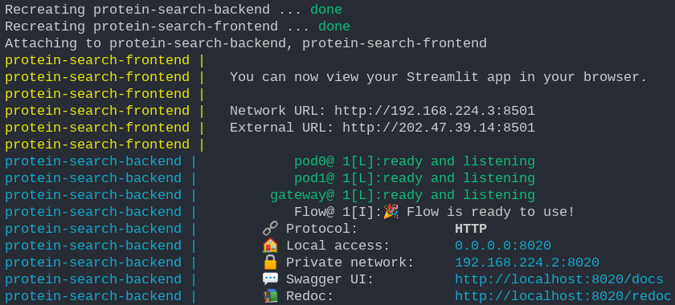

# protein_search

[](https://github.com/fissoreg/protein_search/actions/workflows/build.yml)

Neural search through protein sequences using the ProtBert model and the Jina AI framework.

App demo:

https://user-images.githubusercontent.com/65653499/156157711-f8d5d51c-826d-4466-a2c0-fd9a0b74c092.mp4

- ProtBert https://huggingface.co/Rostlab/prot_bert
- Jina AI https://jina.ai
- 3D protein models http://3dmol.org

## Setting up the environment

First, clone the repository with `git`,

```bash
git clone https://github.com/georgeamccarthy/protein_search/ # Cloning
cd protein_search # Changing directory
```

### :heavy_check_mark: I have Docker

If you're familiar with `Docker`, you can simply run `make docker` (assuming you're running Linux).

The above command will,

1. Create the container for the `frontend`, installs dependencies, starts the `Streamlit` application
2. Create the container for the `backend`, installs dependencies, starts the `Jina` application
3. Provide you with links as logs to access the two containers

Visually, you should see something like,



From there on, you should be able to visit the Streamlit frontend, and enter your protein
relatd query.

Some notes before you use this route,

1. `Docker` takes a few moments to build the wheel for the dependencies, so the `pip` step in each of the containers my last as long as 1-2 minutes.
2. The `torch` dependency in `backend/requirements.txt` is 831.1 MBs large at the time of writing. Unless you get red colored logs, everything is fine and just taking time to be installed for `torch`
3. This project uses the `Rostbert/prot_bert` pre-trained model from `HuggingFace` which is 1.68 GBs in size.

The great news is that you will need to install these dependencies and build the images only once. Docker will cache all of the layers and steps, and caching for the pre-trained model has been integrated.

Some more functionalites provided are,

- To stop the logs from `docker`, press `Ctrl^C`
- For resuming, run `make up`
- To remove the containers from the background, run `make remove`
- To build the containers again, run `make docker`

As for introducing new changes, both the containers do not need to be restarted to do so.

### :x: I don't use Docker

For each of the folders `frontend`, and `backend`, run the following commands

- Making a new `venv` virtual environment,

```bash
cd folder_to_go_into/ # `folder_to_go_into` is either `frontend` or `backend`
python3 -m venv env
source venv/bin/activate
```

- Installing dependencies

```bash
pip install -r requirements.txt
```

If in `backend`, run `python3 src/app.py`

Open a new terminal, head back into the `frontend` folder, repeat `venv` creation and dependency
installation, and run `streamlit run app.py`.

<!-- or using `make`

```
$ make deps
``` 

make deps should be updated to new structure
-->

## Formatting, linting and testing

_Refer to the `Makefile` for the specific commands_

To format code following the [`black`](https://github.com/psf/black) standard
```
$ make format
```

Code linting with [`flake8`](https://github.com/PyCQA/flake8)
```
$ make lint
```

Testing
```
$ make test
```

Testing with coverage analysis
```
$ make coverage
```

Format, test and coverage
```
$ make build
```
